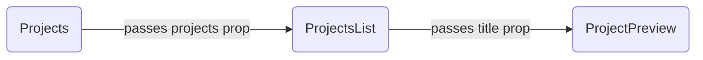

# Instructions

## Goal

It's finally time to create your portfolio! We want you to have a professional portfolio that you can use to show off all the projects you've built in this cohort to prospective employers. And what better way to do than by helping you build one yourself using React? The basic instructions in this lab will result in a simple portfolio that you can personally style and customize to your heart's content.

Here's an example of the sort of bare-bones portfolio that this lab can help you create: [Jackson's Basic portfolio](https://basics--jackson-reeves-portfolio.netlify.app)

And here are some examples of how you can use the bonuses and personal styling to really customize it for your own brand:
- [Jackson's Portfolio](https://complete--jackson-reeves-portfolio.netlify.app)
- Emily's Portfolio
- Beryl's Portfolio

## Minimum Requirements

### Deployed Site

- Deployed using Netlify with a customized URL (e.g., jackson-reeves-portfolio, not something randomly generated like spicy-koala-happy123)
- Landing page prominently features your name (i.e., above the scroll)
- Navigation bar (it must at least link to the home page, but additional links are recommended)
- About section with your name, photo, and bio
- Contact section with a call to action and way to reach you (e.g., a link to your email or a contact form)
- Resume section featuring a link to download a PDF of your resume
- Projects section with all your past coding projects (should include a list of projects that you can click on to view more details for each project; must include your unit 1 and unit 2 projects, but you are encouraged to also include any other coding projects you have publicly deployed, either from classwork or beyond—for instance, if you did a neat Tic Tac Toe game, include it)

### Coded Repository

- Public repository on GitHub
- Freshly created React app (i.e., not a forked or cloned repo)
- Regular commits (at least 10)
- Component for landing page (it can be the App.js file if desired)
- Component for navigation bar
- Component for about section
- Component for contact section
- Component for resume section
- Component for projects section (it should be a list containing multiple project teasers)
- Component for project teasers (it should display a minimal amount of information for the project; clicking on one will show you that project’s details page)
- Component for project details (it should display all the info you’ve stored on your projects)
- Data folder or file with info for your past projects; each project’s info should be contained in an object, and you must include at least the name of the project, a link to an image of the project, a description of the project, a link to the project’s GitHub repo, and a link to the deployed version of the project
- README explaining that this is your portfolio, which you built using React

### Leveling Up

Although not hard requirements, a personalized design can help your portfolio stand out, and a mobile-responsive design will be useful in the event someone ever wants to view your portfolio on their phone or tablet. The bonus section discusses how to implement both of these, and we highly recommend you incorporate them before you begin promoting your portfolio. But, again, they are not requirements in order to pass this assignment.

## Steps

You do not need to follow these steps to successfully complete the assignment. As long as you turn something in that meets the above requirements, you’ll pass! Feel free to skip these steps and just try it on your own. However, we’ve provided these steps to give you a guaranteed blueprint for creating a solid portfolio. Furthermore, even if you want your portfolio to differ dramatically from some of the sample portfolios you’ve seen that use this basic template, we would still recommend that you follow along with these initial steps, since many of the concepts should be applicable to any sort of portfolio. In other words, this template is designed to allow for flexibility either now while you initially create it or later if you want to add something on to it (or remove something from it).

### 1. Initialize repo

Use `npx create-react-app` to generate a new React repo. Remember to only do so after entering your labs folder, and remember to include the name of the project at the end of that command (e.g., `portfolio-react`). Once created locally, be sure to also create a remote version on GitHub, then link the two via the CLI. Commits matter! So link them first thing, and periodically push your code after completing each step.

### 2. Mock out basic functional components for all pages

Since our portfolio will have separate pages for each section, we'll want to create separate components for each of them. Since they'll all be pages, lets group them together in their own folder.

Add a `pages` folder within your project's `src` folder. Within that folder, create separate files for each of the pages: Home, About, Contact, Resume, and Projects. Let's add functional components to each of those files. We'll build them out later, but for now let's just return a heading with the name of the page.

Here's what the About component would look like at this stage:

```js
function About() {
    return (
        <h1>About</h1>
    )
}
```

(Remember to export it!)

### 3. Add routing

Now we need to add a way to view those components. We'll have each one live on its own route; as a result, if you're running your repo locally, and you go to `localhost:3000/about`, you should see the heading from the About component. But that doesn't work currently because our app doesn't have any routing yet. Let's fix that!

Install React Router:

```bash
npm i react-router-dom
```

In your `App.js`, import `Routes` and `Route` from `react-router-dom`. Also import the components for the pages you made in the last section. The top of your file should now look similar to this:

```js
import { Routes, Route } from 'react-router-dom'
import Home from './pages/Home'
import About from './pages/About'
import Contact from './pages/Contact'
import Resume from './pages/Resume'
import Projects from './pages/Projects'
```

Delete all the boilerplate from the App component. Then add opening and closing `Routes` tags to enclose all the routes. For each page, create a `Route` for it inside those `Routes` tags. Here's how the About route would look:

```js
<Route path='about' element={<About />} />
```

Make sure you put the Home component on the root route (aka, `/`). Confirm that you can now see the About header when viewing `localhost:3000/about`.

### 4. Build NavBar component

Now we want a way to easily visit the different pages without needing to manually type in the URL path each time. A navigation bar should do the trick! And we can store it in its own component. Since this won't be a page, let's create a new folder for it (and other non-page components we'll need to build later). Within the `src` folder, create an `elements` folder. Then add a new file: `NavBar.js`. While we could use standard HTML `nav` tags to build our nav bar, let's use Bootstrap. It won't offer any major benefits for the basic version of this portfolio, but later if you try to make it mobile-responsive, you'll probably want a collapsible nav bar, and Bootstrap's Navbar component will make that a much easier upgrade later.

Install React Bootstrap:

```bash
npm i react-bootstrap
```

Within your nav bar file, create a NavBar component. Import `Container`, `Navbar`, and `Nav` from `react-bootstrap`. Since each element in the nav bar will need to be linked, import `Link` from `react-router-dom`. You can use this starter code:

```js
<Navbar bg='light'>
    <Container fluid>
        <Link to='/' className='navbar-brand'>
            Your Name
        </Link>

        <Nav>
            <Link to='/about' className='nav-link'>
                About
            </Link>
            
            <Link to='/contact' className='nav-link'>
                Contact
            </Link>
        </Nav>
    </Container>
</Navbar>
```

Remember to add links to each of the pages you've created so far.

After you create the component, add it to all of your pages by placing it within your App component, above the routes.

### 5. Flesh out your static pages

Previously, we just added some dummy text to all our pages. Let's go back and give each of them some real content. (Don't worry about the Projects page yet; we'll do that next.)

On your home page, include your name, your photo, plus your title (e.g., “Software Engineer”). On your about page, include your photo along with a paragraph or two about yourself. On your contact page, add a basic call to action (e.g., "Reach out if you'd like to work with me!") and a link to your email. On your resume page, add a link to download a PDF of your resume. (You'll need to update your resume, export it as a PDF, and add it to this project's `public` folder first.)

### 6. Store your project data

Now we get to the fun part! The core of any good portfolio is a way to display your past projects. Before we can get to displaying them, though, we'll need to first add the raw data for all of them. Let's create a `data` folder within the `src` folder to store this info. Inside that folder, create a `projects.js` file. That file should contain an array of objects, with each object representing one of your projects. Each of those project objects should contain the following keys (with their corresponding values): 

- title
- description
- image
- repositoryLink
- deploymentLink

All of those keys will have string values, with the `image` key matching a URL for an image that should be a screenshot of that deployed project. You should include both your unit 1 and unit 2 projects, but feel free to add others (e.g., Tic-Tac-Toe).

### 7. Display a list of all your projects

Import the projects data into your Projects component. For now, let's just worry about displaying an unordered list of all your projects' titles. To do that, map over your projects array, so that on each iteration you return an `li` tag containing the project's title. Then wrap the result in `ul` tags. Confirm that you can now see a list of all your projects when you visit `localhost:3000/projects`.

### 8. Break up that functionality across multiple, more specialized components

One of the great things about React components is they allow you to easily break down larger functionality into more easily managed chunks. Right now, the Projects component still looks pretty simple, but as we flesh it out in further steps, it'll get pretty busy. Furthermore, bite-sized components can be reused elsewhere in the app. While we won't benefit from that feature in the basic version of the portfolio, the bonus section demonstrates a way that you could.

Let's start by moving the actual mapping out of the Projects component and into its own component. Create a file in your `elements` folder called `ProjectsList.js`. Next, build out the component. It should look nearly identical to what you previously had in the Projects component, with one notable exception: it will accept `props`, which it will use to get the projects data. Replace your previous code in the Projects component with a tag for the new ProjectsList component, and pass it the imported projects array data as a prop. Confirm that the projects page still looks exactly the same.

Next, let's create a separate component for the project titles inside the `li` tags. We know! It's only the title! However, in the next step, we'll make it display more of the project's data, thus justifying giving it its own component and making it a simple way to preview the project. As a result, let's call this component ProjectPreview and store it in its own file in the `elements` folder. Just like the ProjectsList component, it will accept `props`, but this time it will use those props to get the project's title. Back in the ProjectsList component, replace the current content within the `li` tags with a ProjectPreview tag, and pass it the project's title as a prop. Again, confirm that the projects page still looks exactly the same.

Note the component hierarchy for the projects at this stage:



### 9. Display more data in the ProjectPreview component

Instead of just displaying the project's title, let's display the project's image, too. We can use a Bootstrap card to make that pretty. After you import `Card` from `react-bootstrap`, you can use this code for displaying the image and title:

```js
<Card>
    <Card.Img variant='top' src={props.image} />

    <Card.Body>
        <Card.Title>
            {props.title}
        </Card.Title>
    </Card.Body>
</Card>
```

Remember to then pass the image as a prop to ProjectPreview within the ProjectsList component.

### 10. Build a separate component to display all of a project's data

So far, we've only displayed a project's title and image. But we have so much more info for each project stored in the data array! Because there's so much more information, we don't want to display it all at once on the Projects page. Instead, we'll create a separate page for displaying all of a project's data.

First, create a new file in the `pages` folder: `ProjectDetails.js`. Create a component inside that function. (Note: It won't accept props.) In step 11, we'll make this page dynamically display a different project's data based on the URL path. However, for this stage, we're just going to statically display the data for the first project from the data array. To do that, you'll need to import the `projects` array. Then, in the return section of the component, use an `h1` tag to display the first project's title, a `p` tag to display its description, an `img` tag with a `src` property equal to the project's image, and two buttons, with the first one linking to its GitHub repo and the second one linking to its deployed site. (Hint: You can get the first project's title via `projects[0].title`, and you can use that same pattern for the other properties.)

Second, we need to add a new route to the App in order to display this page. Give the route a path of `projects/:projectDetails`, and be sure to define this route after your definition for the main Projects page's route.

Now, if you go to `localhost:3000/projects/1`, you should see the details for your first project.

### 11. Create helper functions to make ProjectDetails dynamic

Let's say two of your projects are Tic-Tac-Toe and Connect Four. It would be great if when you visited `localhost:3000/projects/tic-tac-toe`, it displayed the details for your Tic-Tac-Toe project, and when you visited `localhost:3000/projects/connect-four`, it displayed the details for your Connect Four project. That's exactly what we built the ProjectDetails component to do and exactly why we put it on a route with a path of `projects/:projectDetails`. However, we need to solve two different problems in order to do that:
- How to convert a title like Connect Four to a string like "connect-four"
- How to take a string like "connect-four" and return all the details for the project with a title that matches

Let's use helper functions to solve both of those problems. Start by creating a `utilities` folder within your `src` folder.

For the first problem, create a file called `hyphenateWords.js` in the `utilities` folder, and inside it create a function that must:
- Take a string as a parameter (e.g., the title of a project)
- Return a new string with all lowercase letters, hyphens instead of spaces, and no special characters (e.g., commas, apostrophes)
- Hint: Check out JavaScript's built-in `replace` method, and look into basic Regex (e.g., `/\s/g` will get all spaces)

For the second problem, create a file called `findProject.js` in the `utilities` folder, and inside it create a function that must:
- Take a string as a parameter (e.g., "connect-four")
- Return an object containing all of a project's data
- Hint: Import the projects data array, use the `filter` method, and implement the `hyphenateWords` function that you just created earlier in order to confirm a match

Once you have those helpers in place, let's implement them in our components.

In the ProjectPreview component, use the `hyphenateWords` function to convert the project's title to a URL path. Add a button to your current card, and link it to that URL path.

In the ProjectDetails component, use the `findProject` function to retrieve that project's data based on its URL path. Then, replace the static references to your first project with dynamic references based on the current project. (Hint: Replace `projects[0].title` with `project.title`, and follow that pattern for the other properties.) But how do we know what the URL path is? Thankfully, React Router provides a hook that can solve that problem. Import `useParams` from `react-router-dom`, and use that get the path parameters from the URL.

Confirm that when you go to your projects page, you can click on different projects' buttons to see their full details rendered on a separate page. 

### 12. Deploy repo

Confirm that everything runs locally as desired, then deploy to Netlify. Customize your URL. Then reconfirm that everything runs as desired on its deployed version.

## Bonuses

### 1. Add personalized styling

### 2. Make mobile responsive

### 3. Customize favicon

### 4. Add submission form to Contact page

### 5. Add footer

Include copyright info, plus links to your social accounts.

### 6. Add more text-based details to each project

For instance, date, inspiration, lessons learned, or future goals.

### 7. Add technologies list to each project

### 8. Display technologies independently with their own pages

### 9. Add dark mode option

## Suggestions

Add a feed of your blog posts from Medium or DEV. Turn it into more of a SPA portfolio by putting the pages all on the home page, giving them id’s, and having the nav bar just slide to them when clicked. Look at some other portfolios for more ideas.